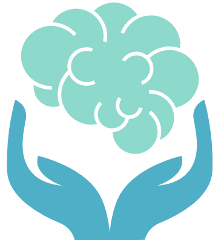

# Aimed for- StarHacks
For the StarHacks Hackathon - https://starhacks.devpost.com/

# Project Title: MindQuest - Helping you on your journey

# Description:
   Technology Stack: 
   HTML/CSS/Javascript on Github/Qoom for website, Figma for Mobile App design
 
## Elevator Pitch
MindQuest, not just another app telling you what, how & when to do things. Instead, choose what you want to do, exchange ideas and play games with alike individuals and all for free.

## Built With
HTML/CSS/Javascript on Github/Qoom for website, Figma for Mobile App design
  

## Inspiration
We were inspired to develop MindQuest due to the lack of interactive platforms and the disappointment it causes among people suffering from mental illnesses. One to one sessions costing obnoxious prices is not something everyone can afford. We built MindQuest to make adequate resources available to everyone and to raise awareness about mental health.

## What It does
MindQuest lets the user choose what and how they want to do things. Our gamified approach ensures engagement with the user, allowing them to take out time for themselves. We have multiplayer games where players can throw and return problems and solutions where they earn stars and win the games. One of the other features here is the stress-meme bubble where a bubble starts forming if the algorithm notices you are stressed and pops into a meme after reaching its limit. Interactive flashcards for inspiration or motivation, daily reminders and a very personalized recommendation make our app stand out. 

## How We Built It
We built it using HTML, CSS & Java for web development and figma for the app designs. We collaborated using GitHub and QOOM.

## What’s Next
We plan to sync the app with the website. We will try to develop a ML algorithm for more personalized recommendations. We will try to diversify the players in the games, by allowing more or categorization. Lastly, we will provide every feature that our opponents provide for free. We will be opening up for donations and will conduct awareness campaigns.

## Challenges
Being in different time zones was troublesome due to being 12 hours apart. We also had to spend quite some time brainstorming ideas because of the limits in mental health.

## Accomplishments We’re Proud Of
Some of our ideas like the gamified approach and anonymous messaging make us stand out. We might work towards developing MindQuest as a real project.
  

## Learning Achievements
We learned better tactics of collaboration and brainstorming. We also learned a lot of facts about mental health that we were unaware of. We learned about the problems people with mental illnesses face and what solutions they have available.
 
## Team
  1. AnnabelleKlosterman-USA
  2. Prachi Nandi- INDIA
  3. MarielKlosterman-USA
  4. ShambhaviShandilya-INDIA
